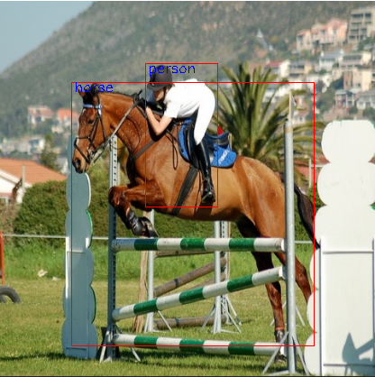

## pytorch_yolov3
- backbone : [Darknet53](https://github.com/mjw2705/object_detection/blob/master/Darknet53.py)
- dataset : VOC2007

  

[make_annotation_csv.py](https://github.com/mjw2705/object_detection/blob/master/make_annotation_csv.py)  
make annotation in csv - image path, image size, bounding box, classes 저장

[Yolov3.py](https://github.com/mjw2705/object_detection/blob/master/Yolov3.py)
Yolo model, Yolo loss  
[Yolov3_tt.py](https://github.com/mjw2705/object_detection/blob/master/Yolov3_tt.py)
Yolo model test

[utils.py](https://github.com/mjw2705/object_detection/blob/master/utils.py)  
change relative coordinates to absolute coordinates   
change absolute coordinates to relative coordinates  
change x, y, w, h to xmin, ymin, xmax, ymax  
find the area of iou 

[preprocess.py](https://github.com/mjw2705/object_detection/blob/master/preprocess.py)
csv 파일을 읽고 custom dataset 만들기  
[preprocessing.py](https://github.com/mjw2705/object_detection/blob/master/preprocessing.py)
annotation으로 custom dataset 만들기

[postprocess.py](https://github.com/mjw2705/object_detection/blob/master/postprocess.py)
non maximum suppression 적용

[train.py](https://github.com/mjw2705/object_detection/blob/master/train.py) 
final train  
[train_test.py](https://github.com/mjw2705/object_detection/blob/master/train_test.py)
train test  
[train_each_epoch.py](https://github.com/mjw2705/object_detection/blob/master/train_each_epoch.py)
drawing bounding box on the image every epoch

[inference.py](https://github.com/mjw2705/object_detection/blob/master/inference.py)
inference code
