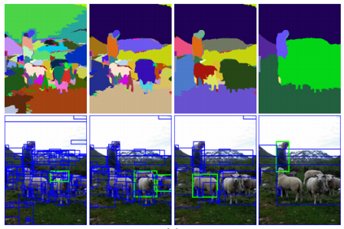
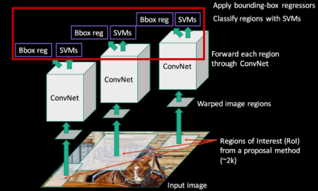
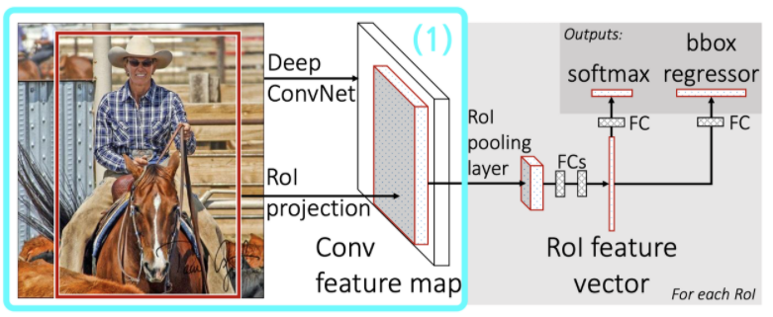
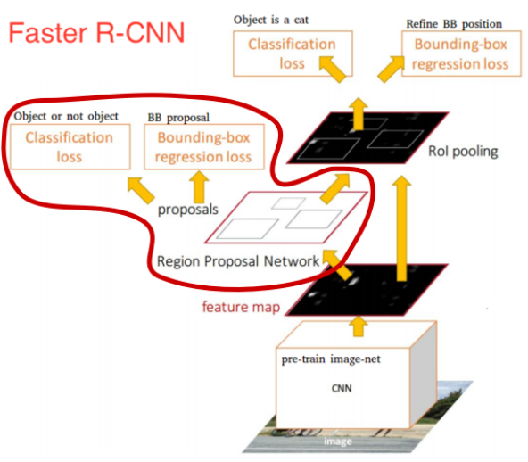
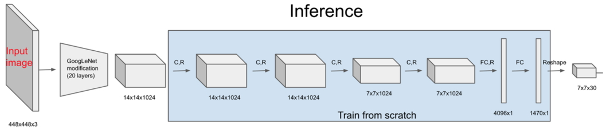
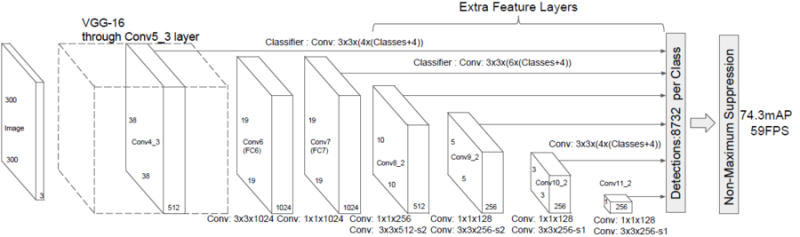
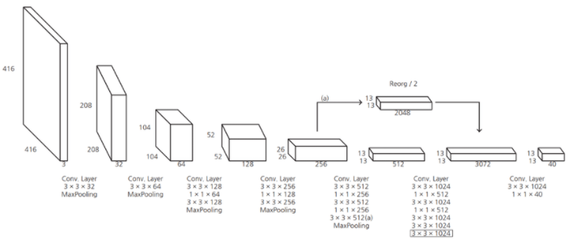
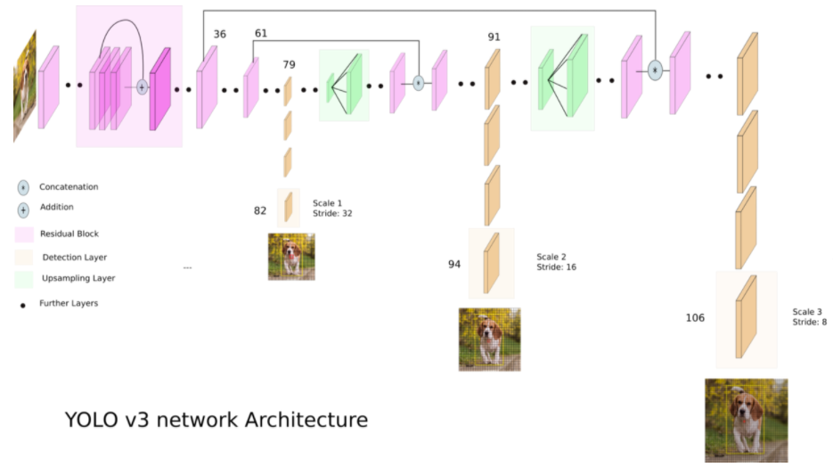

**mAP**  
mean Average Precision : object 1개 당 average Precision을 구하고, 여러 object에 대한 평균값을 구하는 것

**Region Proposal**
- Selective Search(SS) -객체 후보 찾기  

밝기 값 차이를 계산하여 유사한 픽셀끼리 묶어 개체 후보 생성 -> 그룹 하나가 이미지 전체가 될 때까지 반복
- Region proposal network(RPN)

**Non-Maximum Suppression(NMS)**  
동일 물체에 여러 박스가 쳐져 있을 때 score가 가장 높은 박스만 남기고 제거

**IOU(intersection over union)**  
두 박스의 교집합이 threshold보다 크면 한 박스로 판단하고 하나는 제거

**ROI Pooling**  
다양한 크기의 ROI를 고정된 크기로 바꾸기 위한 처리

**Feature pyramid**
- featurized image pyramid  
  - 이미지를 여러 크기로 resize하여 각 image에서 detection
- Single feature map  
  - 최종 feature map으로 detection(Yolo) -> image 정보의 detail정보가 줄어듦
- Pyramidal feature hierarchy  
  - 중간 feature map 각각 에서 detection(SSD) -> 상위 레이어의 추상화 정보 사용하지 못함
- Feature pyramid network(FPN)  
  - 각 feature map을 생성하여 상위 레이어부터 거꾸로 feature을 합쳐서 detection -> 상위 레이어의 추상화 정보와 하위 레이어의 detail 정보를 사용할 수 있다.
  - 해상도를 맞추기 위해 상위 레이어는 upsampling, 하위 레이어는 1x1conv

## R-CNN

1. input image에 SS알고리즘 적용하여 박스 2000개 추출(ROI)
2. 모든 박스를 227 x 227로 resize(warping)
3. warped image를 각각 학습된 CNN에 통과시켜 4096차원 feature map 추출  
  - 학습된 cnn모델 detection용 데이터셋으로 fine tune
4. 각 클래스(object 종류)마다 SVM classifier 학습 -> 어떤 물체일 확률값(score) 계산하여 분류
5. Non-Maximum Suppression을 적용해 IOU가 0.5보다 크면 동일한 물체로 판단하고 박스 한개 제거
6. Bounding box regression을 적용해 박스 위치 조정
  - 선택된 bounding box P를 ground truth bounding box G에 가까워지도록 학습

## SPP-Net
  
기존의 CNN 입력 이미지는 고정되었기 때문에 이미지를 crop하거나 warp해야했기 때문에 입력 이미지 크기에 상관없이 conv layer 통과시키고 FC layer통과 전에 크기 조절

1. 전체 iamge를 학습된 CNN에 통과시켜 feature map 추출
2. SS를 통해 2000개 ROI 박스 추출
3. Spatial Pyramid Pooling(SPP)를 적용하여 고정된 크기의 feature vector
4. fully connected layer 통과
5. 각 이미지 클래스 별로 SVM classifier 학습
6. Bounding box regression을 적용해 박스 위치 조정

## Fast-RCNN

mAP:70%, FPS:0.5  
이전까지는 모델을 학습시키기 위해 여러 단계를 거쳐야 했고, fully connected layer 밖에 학습시키지 못한다는 한계점이 있었지만, fast-RCNN을 통해 CNN 특징 추출부터 classification, bounding box regression까지 하나의 모델에서 학습시키도록 함.

1. 전체 image에 SS를 적용해 ROI추출하고 그대로 갖고 있기.
2. 전체 image를 학습된 CNN에 통과시켜 feature map 추출
3. 각 ROI를 feature map에 ROI projection
4. projection시킨 ROI들에 ROI pooling을 적용하여 고정된 크기의 feature vector 추출
5. feature vector를 Fully connected layer 통과시킴 -> 두 개의 브랜치 생성
6. 1) 하나의 브랜치는 softmax 통과 : 어떤 물체인지 classification  
  2) 다른 브랜치는 Bounding box regression을 통해 박스 위치 조정

**contribution point**
- 이전보다 뛰어난 성능(mAP:70%)
- multi task loss(classification loss와 Bbox regression loss를 동시에 더해 학습) : classification(log loss), Bbox regression(smoothL1 loss)
- 역전파 가능
- feature map을 저장할 필요가 없어 저장공간이 필요없어짐

But, Region Proposal에 시간이 오래 걸리고 이로 인해 bottleneck이 생기게 됨

## Faster-RCNN
  
mAP: 73.2%, FPS:7  
RPN의 도입으로 GPU를 통해 ROI계산이 가능해지고, Region proposal단계를 네트워크 안에서 하기 때문에 진정한 의미의 end-to-end모델이라고 할 수 있음.  
**anchor box에는 x, y, w, h, confidence, class개수의 정보가 들어 있다(3개 scale과 3개 ratio로 총 9개의 anchor box)**

1. 전체 image를 학습된 CNN에 통과시켜 feature map 추출
2. Region Proposal Network(RPN) 적용 -> feature map(H x W x C)에 convolution 3 x 3 x 256/512 적용해서 H x W x 256/512를 얻음
  - classification과 bounding box regression의 예측값을 얻기 위해 1 x 1 conv을 이용해 계산해 fully convolution network의 특징을 가짐.
  1. classification : convolution 1 x 1 x 2(object인지 아닌지) x 9(anchor box 9개)를 수행해 H x W x 18크기 feature map 얻고 softmax 적용  
    - GT label = anchor targeting해서 anchor와 ground truth의 IOU를 계산해서 IOU가 0.7보다 크면 1(positive), 0.3보다 작으면 0(negative)
  2. Bounding box regression : convolution 1 x 1 x 4(boungding box좌표) x 9
  - 각 prediction한 값과 loss function으로 RPN학습
3. classification을 통해 높은 확률의 순으로 K개 앵커를 추리고, 그 앵커들에 bounding box regression을 적용, NMS을 적용해 ROI계산
4. ROI들을 첫번째 feature map에 project하고 ROI Pooling 적용

**contribution point**
- fast-RCNN과 같이 multi-task loss사용하였고, 여기에 RPN의 loss가 추가됨

## YOLO(You Only Look Once)

Faster-RCNN에 비해 정확도는 조금 낮은 mAP 63.4%이지만, 6배 빠른 속도인 FPS:45
이전까지의 클래스 수는 클래스 수 + 1(배경)이였지만 yolo는 아니다.  
backbone network는 학습된 VGG 혹은 Googlenet

1. input image를 S x S grid 영역으로 나눠 각 그리드에서 B개의 bounding box 예측(각 bounding box는 x, y, w, h, confidence)  
  *-confidence = Pr(object) x IOU* (물체가 있을 확률 x ground truth박스와 predict한 박스 간의 IOU)
  *-각 그리드마다 해당 클래스일 확률 = Pr(class|object)*
2. input image로 448 x 448 x 3, output은 7 x 7 x 30 feature map, B=2개, class=20개로 설정 -> 한 그리드에 30차원의 vector(10차원은 두 개의 bounding box, 20차원은 해당 그리드가 특정 클래스일 확률)
  *-해당 box가 특정 클래스일 확률 = confidence x class확률 = Pr(class) x IOU*
  - 모든 B개의 bounding box에 적용하면 98개의 20차원 vector를 얻을 수 있다.
  - 이것을 일렬로 나란히 세우면 각 클래스별로 전체 bounding box에서의 확률 값을 구할 수 있다.
3. NMS 적용해서 겹치는 박스들을 지우고, 벡터에서 최대 값을 계산해 해당 클래스를 박스와 함께 그려준다.
4. loss function -> localization + confidence + classification

단점 : 각 grid 별 bounding box prediction에서 grid보다 크기가 작은 물체는 잡아내지 못하고, CNN을 통과하면서 마지막 feature map만 사용되기 때문에 정보가 누락된다.   
**높은 해상도의 feature map이 작은 객체를 더 잘 찾는다**

## SSD(Single Shot multi-box Detection)
  
detail 정보를 보존하기 위해 각 스케일에 대해 detecor & classifier 수행

## Yolov2
  
1. 기존 dropout layer 없애고 *Batch Normalization* 추가
  -> 각 레이어마다 Normalization하는 레이어를 두어 변형된 분포가 나오지 않도록 함
  -> 미니 배치마다 Normalization을 한다는 뜻에서 Batch Normalization
2. 기존에는 224 x 224로 pretrain된 VGG모델로 448 x 448 크기의 image에 대해 dection을 하여 해상도가 맞지 않았는데, 높은 해상도 이미지로 백본 네트워크를 *fine tune*
3. 기존의 fully connected layer 없애고, fully convolution network 형태로 predict계산
4. *Anchor box(x, y, w, h, 물체일 확률 p)*개념을 적용하여 학습을 안정화
  -> 기존의 7 x 7 feature map은 너무 작아 13 x 13 feature map에서 5개의 anchor box를 사용
  -> input image는 416 x 416
5. 기존에는 anchor box의 크기와 비율이 고정되있지만, yolov2에서는 고정시키지 않고 학습 데이터의 ground truth box에 k-means clustering 방법을 사용해 *최적의 anchor box 5개를 찾음*
  -> 기존의 YOLO는 grid의 중심점을 예측했지만, YOLOv2에서는 grid의 왼쪽 꼭지점으로부터 얼만큼 이동하는지와 너비와 높이를 얼만한 비율로 조절할지를 예측
6. 상위 layer feature map + 하위 layer feature map 하는 passthrough layer(skip connection) 도입
- backbone network: Darknet-19
- class 예측 시 같은 계층 기준으로 softmax 사용

## Yolov3
  
- backbone : Darknet-53
- class 예측 시 softmax 대신 개별 클래스 마다 sigmoid 사용
